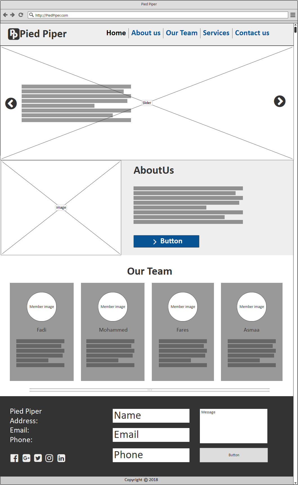

# MainLineTeam portfolio

One-page portfolio website to introduce our company.

## TEAM NAMES:

-  Fadi ElAmassi
-  Fares ElHelo
-  Mohameed Qarmout
-  Asmaa Thabet

## WHY?

we make our portfolio website to market ourselves for our clients and to let others contact with us easily.

## WHAT?

Our site is a single-page website contains many sections :

-  Navbar :
     Display our main parts to facilitate reaching to the needed section .
-  Slider:
     Display photos for our website and flashes headings about our work and services.
-  About Us :
     Give Description about our company work and main tasks that we do .
-  Our Team :
     Display our company Team with job for everyone , small hints about task, and social media accounts.
-  Footer :
     Display **Contact form ** and our address, phone numbers and email.

## HOW?

We divided our project in to Stages:
 

-  Design :  
     we design our project on papers as blocks then we drew it as UI/UX design as below :
   

-  HTML Planning :
     We started to plan html Skeleton by following HTML Semantic in dividing sections and using HTML elements in the right way .

-  Divided Tasks :
     making project Repository in github and divided tasks by making it as issues .

-  Outlining HTML & CSS :
     we put the primary standards for the projects in order to start correctly.

-  working on sections :
     we start to work on our parts by building it by HTML and CSS .

-  Checking code :
     check Responsive and accessability case for every section .

-  collecting parts :
     We started to collect sections together .

-  checking and Fixing issues :
     Solve The issues that appears and take suggestions in mind and try to add it all to have a great website .

## User Journey

-  The User open our portifilo page and see navbar and headings .
-  The User scroll to see about section that identify us .
-  The User scroll to see Our Team Section .
-  The User reach to footer section that have the contact form , our address and contacts .

## User Stories

As a **client looking to hire a team of developers :**

> I want to **visit your site and immediately see a headline about your team**
> So that I **get a concise description of what you have to offer me**.

> I want to **visit your site and see a navigation link for 'About, Team, and Contact'**
> so client can **quickly navigate to the areas of the site I'd like to visit.**

> I want to **be able to contact the developers by filling out and submitting a form by providing my name, email and message information**
> So that **the team have sufficient information to contact me afterwards**

> I want to **click on a navigation link and a corresponding section be made visible in the browser window on the same page**
> So that I **can quickly navigate around the site without having to wait for new pages to be loaded.**

> I want to **easily view the site when browsing on my mobile, tablet or desktop**
> so that I **can understand the sites content easily on whatever device I choose to view it in.**

As a **visually impaired client...**

> I would like to **easily read and understand the text on your site**
> so I can **understand the information available**

As a **blind client...**

> I would like to **easily understand how to navigate the site after my screen reader reads me the content of the site**
> so I can **understand the information available**.
